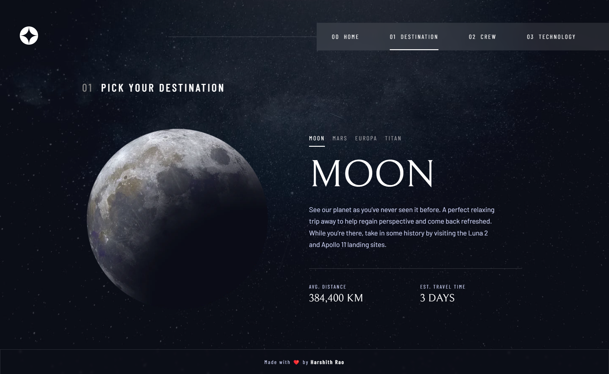
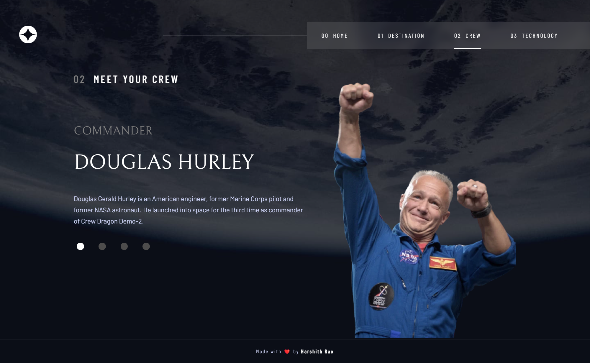
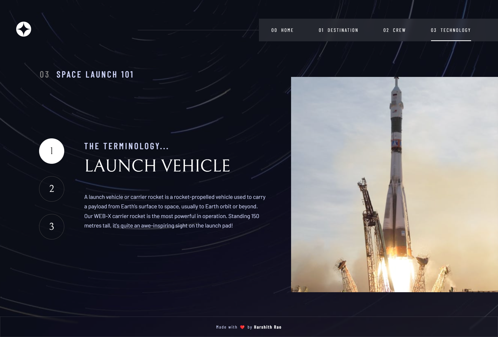
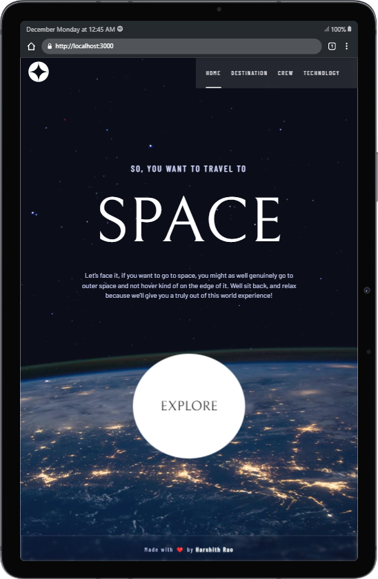
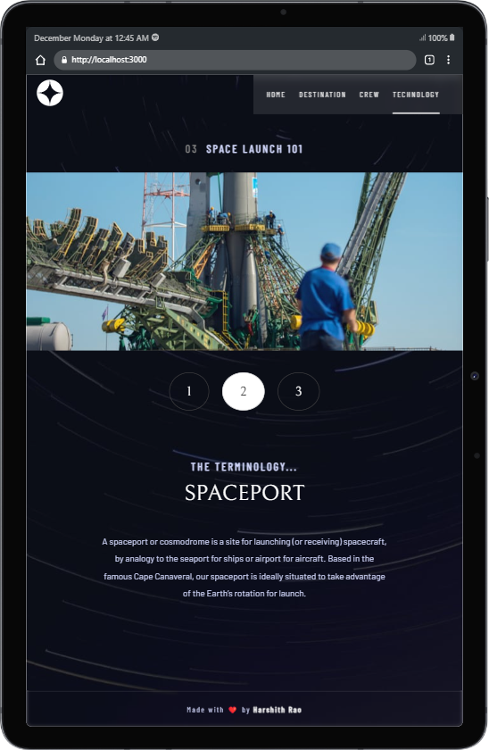
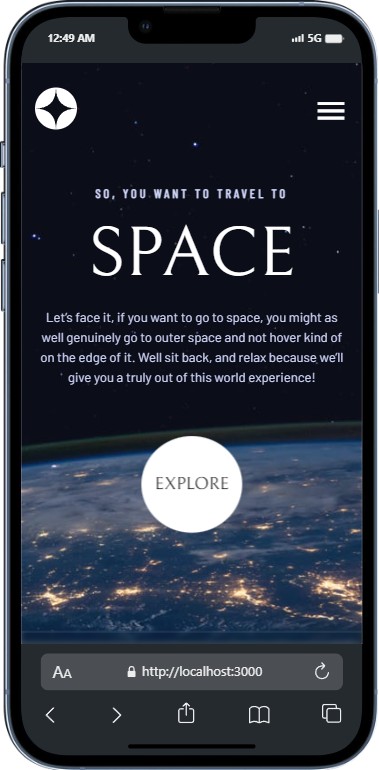
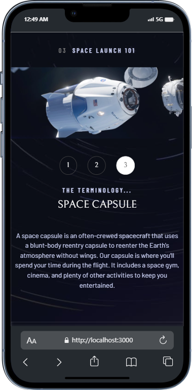
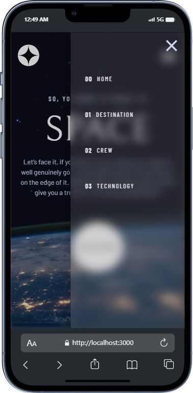

# Frontend Mentor - Space tourism website solution

This is a solution to the [Space tourism website challenge on Frontend Mentor](https://www.frontendmentor.io/challenges/space-tourism-multipage-website-gRWj1URZ3). Frontend Mentor challenges help you improve your coding skills by building realistic projects. 

## Table of contents

- [Overview](#overview)
  - [The challenge](#the-challenge)
  - [Screenshot](#screenshot)
  - [Links](#links)
- [My process](#my-process)
  - [Built with](#built-with)
- [Author](#author)

## Overview

### The challenge

Users should be able to:

- View the optimal layout for each of the website's pages depending on their device's screen size
- See hover states for all interactive elements on the page
- View each page and be able to toggle between the tabs to see new information

### Screenshot

# Desktop

# Tablet

# Mobile

### Links

- Live Site URL: https://tourism-space.vercel.app/

## My process

### Built with

- Semantic HTML5 markup
- CSS custom properties
- Flexbox
- CSS Grid
- Mobile-first workflow
- [Vue](https://vuejs.org/) - JS Framework
- [Nuxt](https://nuxt.com/) - Vue framework
- [Firebase](https://firebase.google.com/) - For fetching data from Firestore Database
- [Vuetify](https://vuetifyjs.com/) - For styled components
- [Vercel](https://vercel.com/) - For hosting the website
- [Material Design Icons](https://pictogrammers.com/library/mdi/) - For stylish icons
- [Google Fonts](https://fonts.google.com/) - For fonts

## Author

- Website - Harshith Rao (https://harshithrao.vercel.app/)
- Github - @harshithrao07 (https://github.com/harshithrao07)
- Frontend Mentor - @harshithrao07 (https://www.frontendmentor.io/profile/harshithrao07)

